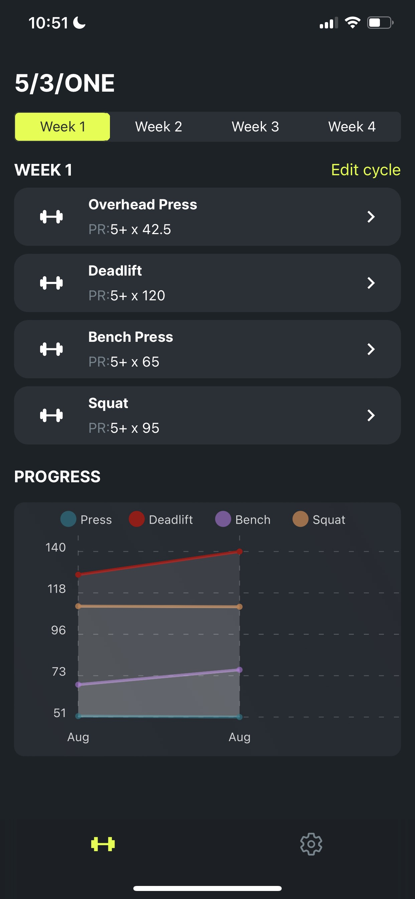
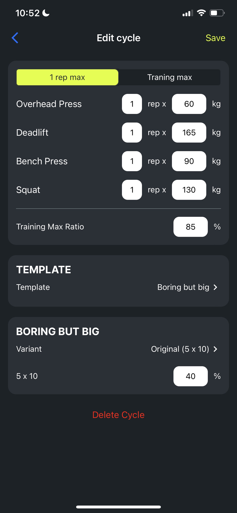
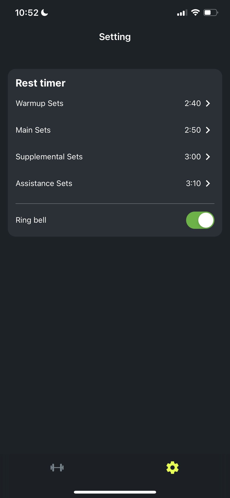
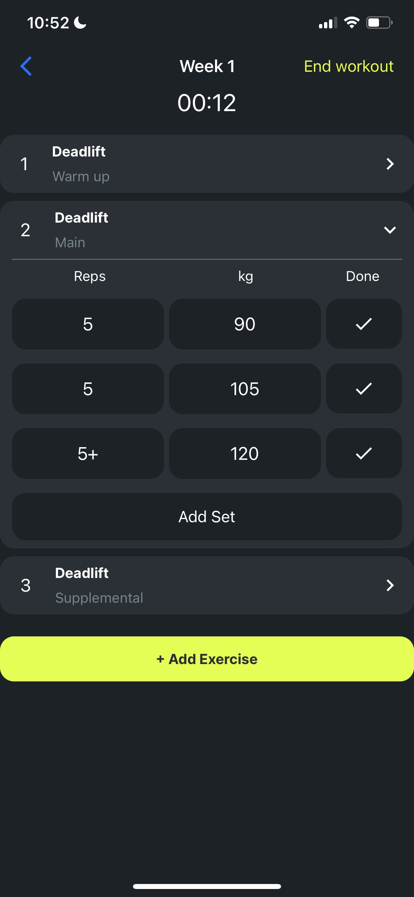
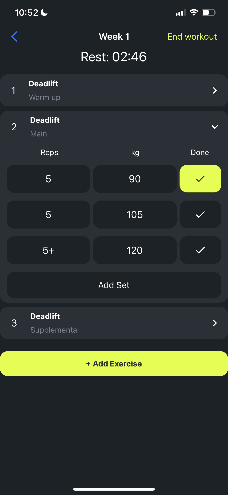

<!-- Logo -->

  

# Raw Strength Workout Tracker App

FOCUS ON GETTING STRONGER, THIS APP TAKE CARE OF THE REST.

This is best app for tracking your progress on Jim Wendler's famous 5/3/1 strength program. From planning your workouts, to tracking your progress.

Created and tested on iOS.

_Live demo <https://expo.dev/@hoangpham56/raw-strength/>_

_Video demo <https://youtube.com/shorts/ljRJnadufIg?feature=share/>_

## Technologies used

  
  
  
  
  
  

## Current Features

- Plan your entire 5/3/1 cycle
- Support 4 day 5/3/1 Boring but big, First Set Last(FSL) templates
- Wamrup sets
- Easy editing of reps, sets and weight during the workout sessions
- Accesory exercises
- Rest timers
- Chart for tracking training max overtime 

## Future Features

- Plate Caculator
- Weight in
- Integrates with Apple Health
- More templates

## 📷 Screenshots

  
  
  
  
  
  

## Author

🎉 **Hoang Pham**